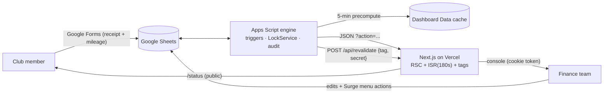

# Surge Finance V3 — System Architecture & Build Specification

> **Audience:** a downstream AI coding agent implementing V3 on top of the existing V2.x codebase.
> **Scope of V3:** (1) a **Member Loan Tracker**, (2) the **"Paper Ledger" editorial redesign**
> (Wealthsimple-grade aesthetic), (3) this consolidated architecture record.
> **Hard rule:** all existing routes, features, and the Apps Script `?action=` API are **frozen —
> additive changes only**. Nothing a member or coordinator can do today may break.

---

## 1. Executive Summary

### 1.1 Project context

| | |
|---|---|
| **Project name** | Surge Finance (SFU Surge club finance system) |
| **Core goal** | Members submit receipts/mileage via Google Forms and can self-track their reimbursement like a parcel; the finance team runs the entire approval → cheque-requisition → SFSS → payout pipeline from one Google Sheet, with a read-only web console for health, search, reports, and year-end. The problem it solves: reimbursements at student clubs are opaque, slow, and tracked in ad-hoc spreadsheets nobody trusts. |
| **Target audience** | ~Hundreds of club members (rare use, mostly mobile) and a 1–3 person finance team (weekly use, desktop + mobile). |
| **Key features** | Self-service status tracking; dual-approval queue; unified expense ledger; cheque requisitions with status cascade; grants & budgets; reconciliation; audit log; reports + CSV; year-end checklist; personal-advance tracking; **(V3) member loan tracking**; password-gated console; command palette. |

### 1.2 What V3 adds

1. **Loan Tracker** — members sometimes *lend the club money* (e.g., the treasurer puts a large
   expense on a personal credit card, or a member e-transfers funds to cover a vendor) that must be
   repaid once the SFSS cheque lands. Today this lives in someone's head. V3 records each loan,
   tracks partial repayments, surfaces total liabilities on the dashboard, flags overdue loans, and
   blocks year-end rollover while loans are outstanding.
   *Distinct from the existing "personal advance" (`Advanced By`) feature: an **advance** is the
   treasurer paying a member out-of-pocket (club owes treasurer); a **loan** is a member funding a
   club expense (club owes member). Both are club liabilities to individuals and render together.*
2. **"Paper Ledger" design language** — replaces the V2 "electric" dark glassmorphism with a calm,
   editorial, Wealthsimple-style system: warm paper background, serif display type, hairline
   borders, rectangular controls, restrained motion, and a scroll-drawn SVG guide line on the
   public page. Full token spec in §5.

### 1.3 Success metrics

| Metric | Target |
|---|---|
| Infrastructure cost | **$0/month** (hard constraint — student club) |
| Member question "where's my money?" answerable without contacting finance | 100% via `/status` |
| Data staleness on the web console | ≤ 5 min routine; seconds for approval/CR events |
| Outstanding liabilities (advances + loans) visible at a glance | 1 dashboard module, always current |
| Loans forgotten at year-end | 0 (rollover checklist blocks on open loans) |
| Audit coverage of state changes | 100% (every mutation writes to Audit Log) |
| New-coordinator onboarding | ≤ 1 session with the onboarding guide |

---

## 2. System Architecture

### 2.1 Stack (and why each piece survives scrutiny)

| Layer | Choice | Justification for a $0, club-scale deployment |
|---|---|---|
| **System of record** | Google Sheets (13 sheets + Loans) | See decision matrix §2.2 — the deciding factor is that **Google Forms (with free Drive file upload) is the member write path** and **the Sheet is the finance team's working surface**. Replacing it means building uploads, storage, auth, and a write UI from scratch for zero user benefit. |
| **Business logic** | Google Apps Script (bound) | Free compute co-located with the data; `onEdit`/`onFormSubmit` triggers are the only zero-cost way to react to Sheet edits; `LockService` serializes mutations; ships a free JSON Web App endpoint. ES5 runtime — enforced in agent rules (§7). |
| **API** | Apps Script Web App, `GET/POST ?action=…` | Already deployed and consumed; contract frozen (§2.4). Pre-computed `Dashboard Data` cache keeps request CPU near zero. |
| **Frontend** | Next.js 14 App Router, **React Server Components by default**, TypeScript strict | RSC + ISR means the club-scale read workload is served from cache, not functions. `'use client'` only for true interactivity (palette, theme, toasts, charts, scroll path). |
| **Styling** | Tailwind + CSS custom properties (token system) | Single-source theming; the V3 restyle is, by design, mostly a **token swap** (§5) because components reference tokens only. |
| **Auth** | Shared password → HMAC-SHA256 token (Apps Script-signed) in an `httpOnly` cookie, 7-day expiry | Right-sized: internal, read-only club data; revocable by rotating the script secret; no third-party auth dependency or cost. |
| **Fonts** | `next/font/google`: **Instrument Serif** (display) + **Inter** (body/data) | Self-hosted by Next at build time — zero runtime requests, zero npm deps. |
| **Icons** | `lucide-react@0.439.0` (existing dep) | Thin-stroke icons suit the editorial aesthetic; **verify every icon name exists in this exact version before use** (a nonexistent export has already broken one deploy). |

### 2.2 Database decision matrix (template requirement: evaluate Neon / Supabase / Turso)

| Criterion | Google Sheets (current) | Neon Postgres + Drizzle | Supabase | Turso (libSQL) |
|---|---|---|---|---|
| Member write path (forms + receipt file upload) | **Native** (Google Forms → Drive) | Build from scratch (uploads need paid storage) | Storage included but UI still custom | Build from scratch |
| Finance team edit surface | **The sheet itself** (zero UI to build) | Full admin CRUD UI required | Same | Same |
| Cost at club scale | $0 | $0 tier OK | $0 tier OK | $0 tier OK |
| Concurrency | LockService (adequate for 1–3 editors) | Excellent | Excellent | Excellent |
| Volume headroom | ~10M cells; club writes ~10²–10³ rows/yr → decades | Effectively unlimited | Same | Same |
| Latency to frontend | Mitigated by 5-min pre-compute + 180s ISR + edit-webhook revalidation | Excellent | Excellent | Excellent (edge) |
| Migration cost | — | **Rebuild ~80% of the engine** (forms, uploads, approvals UI, audit, roles) | Same | Same |

**Verdict: Sheets remains the system of record for V3.** A serverless Postgres move is *not* an
upgrade here — it deletes the product's two best features (native forms intake, sheet-as-admin-UI)
and converts a $0 system into a build project. **Documented migration triggers** (any one → spec V4
on **Turso** for edge reads or **Neon** for relational reporting): multi-club/SaaS ambitions,
>50k expense rows, a requirement for member *write* actions on the web, or sub-second ad-hoc
queries across years. A deferred Drizzle sketch for that future is in §4.5.

### 2.3 Topology



### 2.4 API contract (frozen; V3 changes are additive-only)

| Action | Auth | Returns (shape summary) |
|---|---|---|
| `health` | none | `{status,lastRefresh,sheetId,version}` |
| `authCheck` (POST) | password | `{ok,token,expiresInDays}` \| `{error}` (rate-limited 5/min/IP) |
| `status&email=&id=` | none (rate-limited + cached 60s) | `{ok,email,records[],requestedId}` |
| `dashboard&fy=` | token | `{ok,kpis,charts{...},pipeline,alerts,activity,reconciliation,readyToMoveCount,advances,`**`loans`**`,lists,lastRefresh}` |
| `submissions&page=&q=&status=&type=&project=&from=&to=&min=&max=&sort=&dir=&fy=` | token | `{ok,records[],total,totalPages,sort,dir,fyScope,statusOptions,projectOptions}` |
| `report&type=&…` | token | `{ok,type,filter,summary{...},grant?}` |
| `yearend` | token | `{ok,checklist[]}` (**V3: + "All member loans repaid" item**) |
| `budgetImpact&project=&amount=` | token | `{ok,impact{...}}` |

**V3 additive payload** on `dashboard`:

```ts
loans: {
  outstandingTotal: number;          // sum of (amount - amountRepaid) for non-Repaid loans
  outstandingTotalDisplay: string;
  count: number;
  overdueCount: number;              // due date passed and not Repaid
  byLender: { lender: string; amount: number; amountDisplay: string; count: number }[];
}
```

### 2.5 State management flow

- **Server state**: fetched in Server Components via the existing `fetchAppsScript` wrapper
  (exponential backoff, ISR `revalidate: 180`, tags `dashboard|submissions|reports|year-end`);
  invalidated within seconds by the Apps Script → `/api/revalidate` webhook on significant edits.
- **Client state** (deliberately minimal): theme mode, command palette open/close, toast queue,
  status-page filter/sort (in-memory), URL search params as the canonical filter state for
  `/submissions` and `/reports`. **No global state library** — context + URL params suffice.
- **Writes**: none from the web app, ever. All mutations occur in the Sheet via the engine.

---

## 3. Deployment Strategy

### 3.1 Workload profile (measured assumptions)

Club-scale: ≤ ~50 daily visitors at peak (reimbursement season), JSON payloads 2–80 KB, pages
ISR-cached, zero media served (receipts live in Google Drive and open there), all heavy compute in
Apps Script.

### 3.2 Vercel Hobby limits vs. this workload

| Hobby limit | Our projected usage | Verdict |
|---|---|---|
| 100 GB fast data transfer/mo | < 1–2 GB (small JSON + static, ISR-cached) | ~2% used |
| 1M edge requests/mo | < 50k | ~5% used |
| 10s function timeout | Apps Script responds in 1–4s; backoff capped well below 10s | OK (report endpoint is the slowest; it reads the pre-computed cache where possible) |
| 360 GB-hrs compute | RSC pages are cached; functions are thin proxies | Negligible |
| No persistent servers | App is stateless by design (state in Sheets + cookie) | Perfect fit |

### 3.3 Alternatives considered

| Platform | Assessment |
|---|---|
| **Cloudflare Pages/Workers** | Best raw free tier (1 TB egress), but Next.js App Router requires the `next-on-pages` adapter where **ISR + `revalidateTag` (our Layer-2/3 caching) are not first-class**. Migrating would trade our working revalidation architecture for bandwidth we don't need. **Contingency platform**, not the choice. |
| **Netlify** | Comparable to Vercel with weaker App Router ISR support; no advantage. |
| **VPS + Coolify/Docker** | Unrestricted but **costs money ($4–6/mo), needs patching/uptime ownership**, and a student club has no ops owner across exec turnover. Rejected. |

### 3.4 Decision

**Stay on Vercel Hobby.** It is inside every limit by ≥ 20×, and it is the only zero-cost platform
where our ISR + tag-revalidation design runs natively. **Migration triggers** (re-evaluate to
Cloudflare): sustained egress > 50 GB/mo, a need to proxy receipt images through the app, or
function execution regularly approaching 10s. The realistic scaling bottleneck is **Apps Script
quotas**, already protected by the 5-min precompute cache, per-email status cache, edge rate
limiting, and the hourly circuit breaker.

---

## 4. Data Architecture

### 4.1 Sheet registry (existing — unchanged)

`Settings` (config + lists) · `Approval Queue` (24 cols) · `Mileage Approvals` (16) ·
`Expenses` (24, incl. `Advanced By`) · `CR Tracker` (dynamic FS cols) · `Grants` (20) ·
`Budgets` (11) · `Reconciliation` (2 sections) · `Audit Log` (9) · `Dashboard Data` (cache) ·
`Form Responses 1/2` · `Archive` (Expenses mirror). Keys are string-matched names; row identity is
`Row ID` (`EXP-{base36}-{rand}`), CRs are `CR-{FY}-{###}`.

### 4.2 NEW sheet: `Loans` — 14 columns

| Col | Header | Type | Source | Rules |
|---|---|---|---|---|
| A | `Loan ID` | string | Auto | `LOAN-{base36}-{4rand}` (reuse `generateRowId` with prefix) |
| B | `Date Received` | date | Manual | When the member's money arrived |
| C | `Lender Name` | string | Manual | Who lent the money |
| D | `Lender Email` | string | Manual | For records / e-transfer repayment |
| E | `Amount (CAD)` | currency | Manual | Principal |
| F | `Purpose` | string | Manual | What it covered (e.g., "StormHacks venue deposit") |
| G | `Linked CR #` | string | Manual | Optional FK → `CR Tracker.CR Number`; when that CR turns `Distributed`, the engine reminds finance to repay |
| H | `Status` | string | **Script** | `Open` → `Partially Repaid` → `Repaid`; computed from I vs E on edit — never typed by hand |
| I | `Amount Repaid (CAD)` | currency | Manual | Running total of repayments |
| J | `Date Repaid` | date | Script | Auto-filled when Status becomes `Repaid` (clearable) |
| K | `Repayment Method` | string | Manual | Dropdown ← `list_PaymentMethods` |
| L | `Due Date` | date | Manual | Optional informal deadline |
| M | `Follow-Up Flag` | string | Script | `⚠ OVERDUE: n days` when Due Date passed and not Repaid; refreshed onEdit + daily |
| N | `Notes` | string | Manual | |

**Validation/formatting:** Status dropdown from new `LIST: LoanStatuses` (`Open`, `Partially
Repaid`, `Repaid`) with `allowInvalid:true` (consistent with all other lists); currency formats on
E/I; conditional formatting — `Repaid` row green tint, overdue row amber tint.

### 4.3 Loan business logic (engine, `Loans.gs`)

```
onSheetEdit (Loans, cols E/I/L) → withLock:
  repaid  = parseAmount(I);  principal = parseAmount(E)
  status  = repaid <= 0 ? "Open" : repaid + 0.005 >= principal ? "Repaid" : "Partially Repaid"
  write H if changed; if "Repaid" and J blank → J = today; if not "Repaid" → clear J
  refresh M (overdue flag);  logToAudit(LOAN_RECORDED | LOAN_REPAYMENT | LOAN_REPAID)
  notifyRevalidate_('dashboard')

CR cascade hook (CRTracker.gs, status → Distributed):
  for each Loans row with Linked CR # == this CR and Status != Repaid:
    append Note "💡 CR distributed — repay lender"; include in dashboard alert

Year-end (Archive.gs → computeYearEndChecklist_): add item
  { item: "All member loans repaid", count: nonRepaidCount, ok: nonRepaidCount === 0 }
```

**Audit actions added:** `LOAN_RECORDED`, `LOAN_REPAYMENT`, `LOAN_REPAID` (Audit Log schema unchanged).

### 4.4 Relations (V3 deltas only)

```
Loans.Linked CR #   → CR Tracker.CR Number   (many:1, optional)
Dashboard payload   ← Loans (aggregated)      + Expenses.Advanced By (existing)
Year-End checklist  ← Loans (non-Repaid count)
```

### 4.5 Deferred V4 migration sketch (only if a §2.2 trigger fires)

```ts
// drizzle/schema.ts — illustrative target, DO NOT build in V3
import { pgTable, text, numeric, date, timestamp } from "drizzle-orm/pg-core";
export const loans = pgTable("loans", {
  id: text("id").primaryKey(),                  // LOAN-…
  lenderName: text("lender_name").notNull(),
  lenderEmail: text("lender_email"),
  amount: numeric("amount", { precision: 10, scale: 2 }).notNull(),
  amountRepaid: numeric("amount_repaid", { precision: 10, scale: 2 }).default("0"),
  crNumber: text("cr_number").references(() => crs.number),
  dueDate: date("due_date"),
  repaidAt: timestamp("repaid_at"),
});
// Validate all API I/O with Zod at the boundary; derive types via z.infer.
```

---

## 5. Design System — "Paper Ledger" (V3 redesign)

The Wealthsimple brief, translated into our token architecture. Because every component already
consumes CSS custom properties, **this restyle is executed primarily in `globals.css` +
`tailwind.config.ts`**, with targeted component edits where V2 idioms are banned below.

### 5.1 Principles & kill list

- Sophisticated, confident, anti-generic. The numbers are the heroes; chrome recedes.
- **Remove from V2:** brand gradient (`--gradient-brand`), `brand-glow`, all glassmorphism
  (`.glass` becomes solid surface + hairline border), spring animations (`animate-pop`,
  `--ease-spring`), pulse effects (`pulse-once`, `dot-live` glow → static 6px dot), heavy shadows,
  pill buttons. Badges become **rectangular 4px tags with 1px borders**, not pills.
- **Borders over shadows:** every card/divider is `1px solid var(--color-border)`. Shadows exist
  only on true overlays (palette, toasts) and are soft and small.
- Motion: `ease-out 0.2s` hovers (opacity/color only), one scroll-drawn SVG line (§5.6). Nothing
  bounces. `prefers-reduced-motion` disables the SVG drawing (line renders fully drawn).

### 5.2 Color tokens

**Theme "paper" (default, light):**

| Token | Value | Use |
|---|---|---|
| `--color-bg` | `#FDFCF8` | Page background (warm off-white) |
| `--color-surface` | `#FFFFFF` | Cards |
| `--color-surface-2` | `#F6F3EC` | Inputs, table header band |
| `--color-surface-3` | `#EFEAE0` | Hover fills, track bars |
| `--color-border` | `#E6D9CC` | **All** card borders & dividers (1px) |
| `--color-text` | `#32302F` | Primary text (deep charcoal) |
| `--color-text-secondary` | `#6B6661` | Secondary text |
| `--color-text-muted` | `#8A847C` | Captions/timestamps |
| `--color-accent` | `#EBCB8B` | Soft gold — **decorative only** (SVG path, bar fills, underlines); contrast ≈1.6:1 on bg → never body text |
| `--color-accent-ink` | `#8C6D2F` | Text-safe gold (≈5.2:1) for links/labels needing accent |
| `--color-primary-strong` | `#32302F` | Button background (charcoal); button text `#FDFCF8` |
| Semantic | success `#2F6B4F` · warning `#9A6B2F` · danger `#A4453D` · info `#3E5F8A` | Muted, ink-like; AA on `--color-bg` |

**Theme "ink" (dark variant — preserves the existing theme toggle):** bg `#171614`, surface
`#1E1C1A`, surface-2 `#262320`, border `#37322C`, text `#F2EFE9`, secondary `#A8A29B`, accent
`#D9B779` (decorative) / `#E2C794` (text-safe), button = `#F2EFE9` bg with `#171614` text.
Same kill list applies. `system` mode keeps working.

### 5.3 Typography

| Role | Font | Rules |
|---|---|---|
| Display / H1 / H2 / big stats labels | **Instrument Serif** (`next/font/google`, weight 400) | `letter-spacing: -0.03em; line-height: 1.05`; sizes: hero 44–56px, H1 32px, H2 24px |
| Body, UI, tables | **Inter** | 400 body, 500 labels/buttons; 14px base |
| **All numerals/money** | Inter, `font-variant-numeric: tabular-nums` | Rendered slightly larger than surrounding text (e.g., KPI value 28px sans vs 12px label); right-aligned in tables |

```ts
// app/layout.tsx
import { Inter, Instrument_Serif } from "next/font/google";
const inter = Inter({ subsets: ["latin"], variable: "--font-inter" });
const serif = Instrument_Serif({ weight: "400", subsets: ["latin"], variable: "--font-serif" });
// <html className={`${inter.variable} ${serif.variable}`}>; expose `font-serif` in Tailwind.
```

### 5.4 Components

| Component | V3 spec |
|---|---|
| Button (primary) | Rectangular, `border-radius: 4px`, bg `--color-primary-strong`, text `--color-bg`; hover: `opacity: .85` only, `ease-out .2s`; no transform, no shadow |
| Button (ghost) | Transparent, `1px solid --color-border`, text `--color-text`; hover bg `--color-surface-2` |
| Card | `--color-surface`, `1px solid --color-border`, radius 4–6px, **no hover lift** (subtle border-darken on interactive cards) |
| Badge/tag | Rectangular 4px radius, `1px` border in the semantic color at ~40% strength, text in the semantic ink color; no filled pills |
| Inputs | `--color-surface-2`, 1px border, 4px radius; focus = border `--color-text` (no glow ring; keep the global `:focus-visible` outline for a11y) |
| Tables | Hairline row dividers, `--color-surface-2` header band, generous 12px cell padding, tabular numerals, status as tags |
| Charts | Recolor to an earthy muted series: charcoal `#32302F`, gold `#EBCB8B`, silver `#BDC3C7`, sage `#7A8B7F`, clay `#B08968`, slate `#5F6C7B`; doughnuts get thin rings (cutout ~72%); bars flat with 2px radius; legends in Inter 11px secondary |
| Progress stepper (/status) | Keep mechanics; restyle: charcoal filled steps, gold ring on active, hairline connectors |

### 5.5 Layout & structure

- **Container:** `max-width: 1100px` everywhere (replaces 1200px).
- **Public `/status` = editorial:** hero gets generous vertical padding (`6rem` mobile → `10rem`
  desktop), serif headline, and the **asymmetric 2-column split** — left: bold serif statement
  ("Track your reimbursement."), right: the lookup card / summary stats. *(The brief's 10–15rem
  applies to marketing-scale sections; data views below the fold step down to 4–6rem so results
  stay reachable.)*
- **Console = calm density:** same tokens, but spacing stays workmanlike (data tools are not
  brochures — Wealthsimple's own app is denser than its marketing site). Sidebar becomes paper
  with a charcoal active rail (gradient rail removed); avoid 3-up feature grids; prefer 2-column
  asymmetric arrangements (e.g., dashboard: KPIs+funnel left ⅔, attention+liabilities right ⅓).

### 5.6 Scroll-driven SVG guide line (public `/status` only)

A 1.5px gold line drawn down the left gutter as the user scrolls, connecting hero → lookup →
results → FAQ. Implementation (client component `ScrollPath.tsx`, vanilla, **no new deps**):

```tsx
"use client";
// Absolutely-positioned <svg> in the page's left gutter (hidden < lg and when
// prefers-reduced-motion). Path uses pathLength={1}, strokeDasharray={1};
// a rAF-throttled scroll handler sets strokeDashoffset = 1 - progress, where
// progress = scrolled fraction of the content container. Gentle curves
// (cubic béziers) swing the line toward each section's edge as it descends.
// stroke: var(--color-accent); strokeWidth: 1.5; fill: none; aria-hidden.
```

Acceptance: 60fps (transform-free, dashoffset only), fully drawn for reduced-motion users, never
intercepts pointer events, invisible on mobile.

### 5.7 V3 surface checklist (what the agent restyles)

1. Tokens + Tailwind + fonts (this section). 2. Shell: PublicBar/Sidebar/TopBar/BottomNav to paper
idiom; remove glass/gradient. 3. `/status` editorial hero + ScrollPath + restyled cards/stepper/
chips/FAQ. 4. Dashboard: KPI serif-label cards, funnel & charts recolor, **Liabilities module**
(advances + loans, §6.3). 5. Submissions/Reports/Year-End/AuthGate/command-palette/toasts:
token-driven pass + badge/button/border conformance. 6. A11y re-verification (AA on both themes,
focus, reduced-motion).

---

## 6. Core Workflows

### 6.1 Receipt reimbursement (existing, end-to-end)

1. Member submits the Receipt Google Form (file upload → Drive) → engine creates an
   `Approval Queue` row (`Pending`), audits, computes receipt age/duplicates.
2. Coordinator reviews, assigns **Project + Category** (hard-required), approves; Director
   approves (Sequential mode default). Status → `Fully Approved`.
3. Coordinator runs **Move to Expenses** (budget-impact preview, confirm-time recheck inside the
   lock) → row lands in `Expenses` as `Approved`; member's tracker updates.
4. Coordinator selects approved expenses → **Create Cheque Requisition** → CR with per-funding-
   source allocation; funding total must match before `Submitted` is allowed.
5. CR status advances (`Submitted → Approved by SFSS → Cheque Received → Distributed`); every
   change cascades to linked expenses and the member's `/status` page automatically.
6. Reconciliation §1 verifies expected vs received; §2 logs payouts. Member sees `Reimbursed`.

### 6.2 Loan lifecycle (NEW)

1. A member lends money for a large expense (e.g., treasurer's credit card covers a venue; member
   e-transfers the treasurer or pays the vendor).
2. Finance adds a row in **Loans**: lender, date, amount, purpose; optionally links the CR that
   will eventually refund the club. Status auto-sets `Open`; audit `LOAN_RECORDED`.
3. Dashboard **Liabilities** module immediately shows "Owed to members: $X" with a per-lender
   breakdown; an `info` alert appears, escalating to `warning` if a Due Date passes (`OVERDUE`).
4. When the linked CR turns `Distributed` (SFSS money arrived), the engine notes the loan row and
   raises an alert: *"CR-2526-004 distributed — repay J. Smith $850."*
5. Finance repays (e-transfer), enters the amount in **Amount Repaid**. Engine computes
   `Partially Repaid` or `Repaid`, autofills `Date Repaid`, audits `LOAN_REPAYMENT`/`LOAN_REPAID`.
6. Year-end: rollover checklist shows **"All member loans repaid — N remaining"** and stays ⚠ until
   every loan is `Repaid`.

### 6.3 Liabilities at a glance (NEW dashboard module)

`LiabilitiesSection` replaces the advances-only card: one bordered module, two ledgers —
**Owed to treasurer** (existing `advances`) and **Owed to members** (new `loans`), each with
per-person rows (`name · $amount · n items`), a combined total in large tabular serif-labeled
numerals, and the auto-clear notes. Empty state: "No outstanding liabilities."

### 6.4 Personal advance (existing — unchanged, contrast)

Treasurer pays a member before SFSS pays the club → set Payment Method `E-Transfer (via Finance
Director)`, Status `Reimbursed`, put the treasurer's name in `Advanced By`. Clears automatically
when the linked CR distributes. (Use a **Loan** when the money flowed *into* the club; use an
**Advance** when it flowed *out of the treasurer's pocket to a member*.)

### 6.5 Member self-service lookup (existing)

`/status` → email (remembered 14 days, never auto-submitted) → unified records (AQ + Expenses +
Mileage) with stage tracker, summary chips, sort, CSV export, share links, FAQ.

### 6.6 Year-end (existing + V3 item)

Checklist (CRs terminal, balances zero, grants resolved, budgets closed, queues clear, archiving,
**loans repaid**) must be all-green → Director runs rollover; archiving is copy-verify-then-delete.

---

## 7. AI Agent Implementation Rules

1. **Frozen contracts.** Do not rename/remove any route, `?action=` parameter, or response field.
   New fields are additive. Every V2 feature must work identically after V3.
2. **TypeScript strict; no `any`** (use `unknown` + narrowing). API responses typed in
   `src/lib/types.ts`; no inline anonymous response types in pages.
3. **Tokens only.** No hex values in components — colors come exclusively from `globals.css`
   custom properties / Tailwind token classes. The §5 palettes live only in the token layer.
4. **Apps Script is ES5.** `var`, no arrow functions/template literals/optional chaining. Every
   mutation wrapped in `withLock`; every state change calls `logToAudit`; UI feedback via
   `safeToast_`. New code follows existing file-per-domain layout (`Loans.gs`).
5. **Bootstrap is the schema authority.** `Loans` sheet, `LIST: LoanStatuses`, conditional
   formats, and the `loans` Dashboard-cache key are added to `bootstrap.gs` so `buildAll()`
   rebuilds the complete V3 schema from scratch. Update `COLS`/`SHEETS` maps in `Config.gs`.
6. **Dependencies are gated.** Zero new npm packages without explicit approval. Fonts via
   `next/font` only. Before using any `lucide-react` icon, verify the export exists in
   `0.439.0` (a bad icon name has already caused a failed deploy).
7. **Component discipline.** Shared UI in `src/components/` (`ui/` for primitives); pages stay
   Server Components; `'use client'` only where interaction demands it; URL params remain the
   state container for list filters.
8. **Accessibility AA.** Both themes pass contrast (gold `#EBCB8B` is decorative-only — never
   text); keep `:focus-visible`, skip-link, `aria-live` toasts, labels on all controls;
   `prefers-reduced-motion` disables the scroll path drawing and entrance animations.
9. **Money formatting.** Always `formatCAD` + `tabular-nums`; never raw floats in UI.
10. **Verification.** This environment may lack Node — statically verify imports/exports/icon
    names before committing; Vercel runs the real build on push. Keep ESLint non-blocking,
    TypeScript checking ON. Commit in logical chunks with descriptive messages.
11. **Docs ride along.** Update `SETUP.md` (loan workflow), the onboarding guide generator, and
    `HARDENING.md` when behavior is added.

---

## 8. Build plan (suggested execution order)

| Chunk | Contents |
|---|---|
| 1 | Engine: `Loans.gs`, bootstrap additions, Config maps, CR-distributed hook, year-end item, dashboard `loans` payload + cache + alerts |
| 2 | Frontend data: types (`LoansSummary`), `LiabilitiesSection`, year-end row renders automatically |
| 3 | Design tokens: §5.2 palettes (paper + ink), fonts, kill-list removals in `globals.css`/Tailwind |
| 4 | Shell + console restyle (sidebar/topbar/bottom-nav/palette/toasts/AuthGate) |
| 5 | `/status` editorial hero + asymmetric split + `ScrollPath` + card/stepper restyle |
| 6 | Dashboard/submissions/reports/year-end conformance pass + chart recolor |
| 7 | A11y + static QA sweep; docs (SETUP/guide/HARDENING); final review |

*Each chunk = one commit; the user deploys by `git push` (Vercel builds; `buildAll()` +*
*re-deploy of the Apps Script project required once for Chunk 1).*
